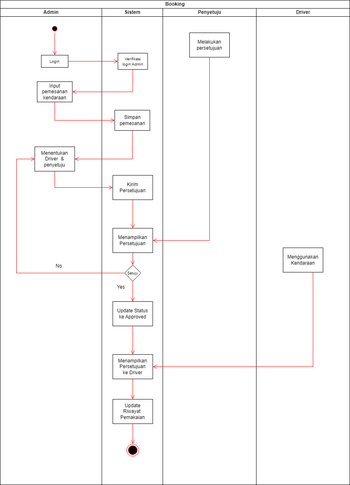

<p align="center"><a href="https://laravel.com" target="_blank"></a></p>

<p align="center">
<a href="https://github.com/laravel/framework/actions"></a>
<a href="https://packagist.org/packages/laravel/framework"></a>
<a href="https://packagist.org/packages/laravel/framework"></a>
<a href="https://packagist.org/packages/laravel/framework"></a>
</p>

## About Project

Membuat aplikasi web untuk manajemen reservasi dan monitoring kendaraan yang memungkinkan perusahaan mengelola pemakaian kendaraan dengan efisien, melacak aktivitas kendaraan, dan mendapatkan data performa operasional kendaraan secara keseluruhan.

Admin 
- Email : admin@gmail.com
- Password : password123

Driver
- Email : budiono@gmail.com
- Password : password123

Penyetuju
- Email : joko@gmail.com
- Password : password123

---

Activity Diagram

 

## Fitur Utama
- Pemesanan kendaraan oleh Admin.
- Penyetujuan pemesanan oleh Penyetuju.
- Pemakaian kendaraan oleh Driver.
- Riwayat pemakaian kendaraan.
- Servis kendaraan.
- Laporan status kendaraan.

## Skema Database

Berikut adalah skema database yang digunakan dalam sistem ini:

### 1. Tabel: `users`
Menyimpan data pengguna dalam sistem.

| Kolom               | Tipe Data      | Deskripsi                   |
|---------------------|----------------|-----------------------------|
| `id`                | `BIGINT`       | ID pengguna (Primary Key)    |
| `name`              | `VARCHAR(255)`  | Nama pengguna               |
| `email`             | `VARCHAR(255)`  | Email pengguna              |
| `password`          | `VARCHAR(255)`  | Password pengguna           |
| `role`              | `VARCHAR(50)`   | Peran pengguna (admin, user, penyetuju) |
| `email_verified_at` | `TIMESTAMP`     | Waktu verifikasi email      |
| `created_at`        | `TIMESTAMP`     | Tanggal pembuatan pengguna  |
| `updated_at`        | `TIMESTAMP`     | Tanggal pembaruan pengguna  |

### 2. Tabel: `kendaraan`
Menyimpan data kendaraan yang ada dalam sistem.

| Kolom               | Tipe Data      | Deskripsi                   |
|---------------------|----------------|-----------------------------|
| `id`                | `UUID`         | ID kendaraan (Primary Key)   |
| `nomor_polisi`      | `VARCHAR(15)`   | Nomor polisi kendaraan (Unique) |
| `merk`              | `VARCHAR(100)`  | Merk kendaraan               |
| `model`             | `VARCHAR(100)`  | Model kendaraan              |
| `tahun_produksi`    | `INTEGER`       | Tahun produksi kendaraan     |
| `jenis`             | `VARCHAR(50)`   | Jenis kendaraan (pribadi, angkutan) |
| `kapasitas_tangki`  | `INTEGER`       | Kapasitas tangki kendaraan   |
| `jarak_tempuh_total`| `INTEGER`       | Total jarak tempuh kendaraan |
| `status`            | `VARCHAR(50)`   | Status kendaraan (available, in use, maintenance) |
| `created_at`        | `TIMESTAMP`     | Tanggal pembuatan kendaraan  |
| `updated_at`        | `TIMESTAMP`     | Tanggal pembaruan kendaraan  |

### 3. Tabel: `pemakaian_harian`
Menyimpan data pemakaian kendaraan setiap hari.

| Kolom                     | Tipe Data      | Deskripsi                    |
|---------------------------|----------------|------------------------------|
| `id`                      | `UUID`         | ID pemakaian (Primary Key)    |
| `tanggal`                 | `DATE`         | Tanggal pemakaian kendaraan   |
| `kendaraan_id`            | `UUID`         | Foreign Key ke `kendaraan.id` |
| `jarak_tempuh_harian`     | `INTEGER`      | Jarak tempuh kendaraan hari itu |
| `bahan_bakar_digunakan`   | `INTEGER`      | Jumlah bahan bakar yang digunakan (liter) |
| `driver_id`               | `BIGINT`       | Foreign Key ke `users.id` (Driver) |
| `created_at`              | `TIMESTAMP`    | Tanggal pembuatan pemakaian  |
| `updated_at`              | `TIMESTAMP`    | Tanggal pembaruan pemakaian  |

### 4. Tabel: `servis_kendaraan`
Menyimpan data servis kendaraan.

| Kolom               | Tipe Data    | Deskripsi                   |
|---------------------|--------------|-----------------------------|
| `id`                | `UUID`       | ID servis (Primary Key)      |
| `kendaraan_id`      | `UUID`       | Foreign Key ke `kendaraan.id`|
| `tanggal_servis`    | `DATE`       | Tanggal servis kendaraan     |
| `jenis_servis`      | `VARCHAR(100)`| Jenis servis                 |
| `biaya_servis`      | `TEXT`       | Biaya servis                 |
| `keterangan`        | `TEXT`       | Keterangan servis            |
| `created_at`        | `TIMESTAMP`  | Tanggal pembuatan servis     |
| `updated_at`        | `TIMESTAMP`  | Tanggal pembaruan servis     |

### 5. Tabel: `riwayat_pemakaian`
Menyimpan riwayat pemakaian kendaraan.

| Kolom               | Tipe Data    | Deskripsi                   |
|---------------------|--------------|-----------------------------|
| `id`                | `UUID`       | ID riwayat pemakaian (Primary Key) |
| `kendaraan_id`      | `UUID`       | Foreign Key ke `kendaraan.id` |
| `tanggal_mulai`     | `DATE`       | Tanggal mulai pemakaian     |
| `tanggal_selesai`   | `DATE`       | Tanggal selesai pemakaian   |
| `keperluan`         | `VARCHAR(255)`| Keperluan pemakaian kendaraan |
| `lokasi_asal`       | `VARCHAR(255)`| Lokasi asal kendaraan        |
| `lokasi_tujuan`     | `VARCHAR(255)`| Lokasi tujuan kendaraan      |
| `jarak_tempuh`      | `INTEGER`    | Jarak tempuh kendaraan (km)  |
| `driver_id`         | `BIGINT`     | Foreign Key ke `users.id` (Driver) |
| `status`            | `VARCHAR(50)`| Status (pending, approved, rejected) |
| `created_at`        | `TIMESTAMP`  | Tanggal pembuatan riwayat    |
| `updated_at`        | `TIMESTAMP`  | Tanggal pembaruan riwayat    |

### 6. Tabel: `booking`
Menyimpan data pemesanan kendaraan.

| Kolom               | Tipe Data    | Deskripsi                   |
|---------------------|--------------|-----------------------------|
| `id`                | `UUID`       | ID pemesanan (Primary Key)   |
| `kendaraan_id`      | `UUID`       | Foreign Key ke `kendaraan.id`|
| `driver_id`         | `BIGINT`     | Foreign Key ke `users.id` (Driver) |
| `approved_by`       | `BIGINT`     | Foreign Key ke `users.id` (Penyetuju) |
| `tanggal_pemesanan` | `DATE`       | Tanggal pemesanan            |
| `keterangan`        | `TEXT`       | Keterangan pemesanan         |
| `status`            | `ENUM('pending', 'approved', 'rejected', 'done')` | Status pemesanan (pending, approved, rejected, done) |
| `created_at`        | `TIMESTAMP`  | Tanggal pembuatan pemesanan  |
| `updated_at`        | `TIMESTAMP`  | Tanggal pembaruan pemesanan  |

## PENTING!!!

Pastikan Anda sudah menginstal:
- [PHP](https://www.php.net/downloads.php) versi 8.1 atau lebih baru
- [Composer](https://getcomposer.org/download/)
- [Node.js dan npm](https://nodejs.org/en/download/)
- Database MySQL atau MariaDB

## Setup Project

Ikuti langkah-langkah berikut untuk menginstal dan menjalankan project ini di lingkungan lokal Anda.

### 1. Install Dependencies 

install:

```bash
composer install
```

### 3. Salin File Konfigurasi
Salin file .env.example dan ubah namanya menjadi .env:

```bash
cp .env.example .env 
```

### 4. Generate Application Key
Jalankan perintah berikut untuk menghasilkan APP_KEY:

```bash
php artisan key:generate
```

### 5. Konfigurasi Database
Buka file .env dan perbarui konfigurasi database Anda: 

```bash
DB_CONNECTION=mysql
DB_HOST=127.0.0.1
DB_PORT=3306
DB_DATABASE=nama_database
DB_USERNAME=username_database
DB_PASSWORD=password_database
```

### 6. Jalankan Migrasi dan Seeder
Jalankan migrasi database untuk membuat tabel-tabel yang diperlukan:

```bash
php artisan migrate
```
```bash
php artisan db:seed
```

### 7. Install Laravel Breeze
Jalankan perintah berikut:
```bash
composer require laravel/breeze --dev
php artisan breeze:install
```

8. Install Dependencies Frontend dan Compile Asset
Install dependensi frontend menggunakan npm, lalu kompilasi aset:
```bash
npm install
npm run dev
```

### 9. Menjalankan Server Lokal
Untuk menjalankan aplikasi, jalankan perintah berikut:
```bash
php artisan serve
```

